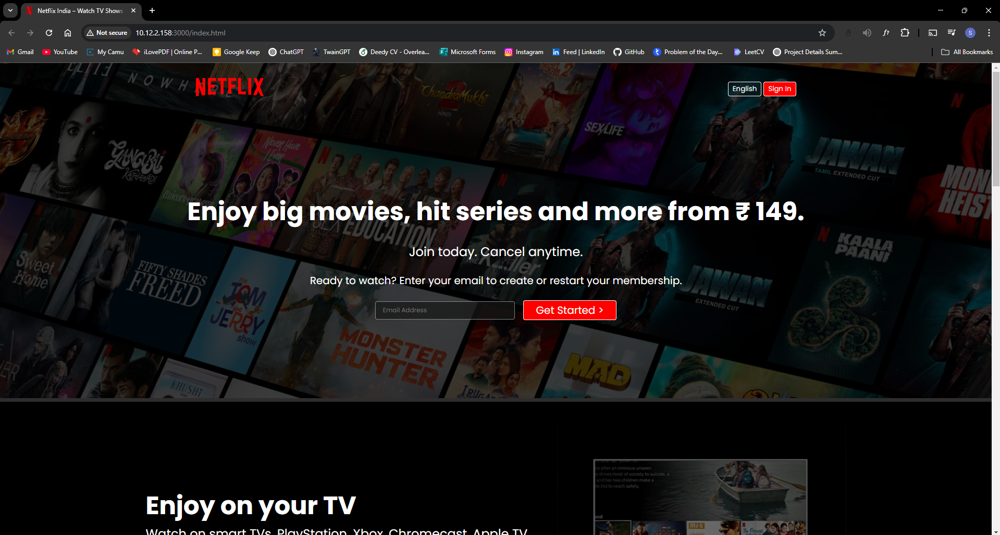

# 🎬 Movie Streamer - Netflix-Inspired Clone

A simple **Movie Streaming Homepage Clone** built using **HTML & CSS**, inspired by the design of Netflix’s homepage.

## 🚀 Project Overview

This is a front-end project that **recreates the look and feel of a popular streaming platform**. It features a clean UI, responsive design, and includes sections like the hero banner, subscription info, FAQs, and a footer.

> ⚠️ **Disclaimer:** This project is for educational and portfolio purposes only. It is **not affiliated with, endorsed by, or a replica of Netflix Inc.** All trademarks and copyrights belong to their respective owners.

## 🌟 Features

✅ **Responsive Design** – Works on various screen sizes
✅ **Hero Section** – Includes a call-to-action for subscriptions
✅ **CSS Styling** – Custom styles for a streaming app feel
✅ **FAQ Section** – Expandable questions for user convenience
✅ **Footer Section** – Contains useful links

## 📸 Preview



## 🛠️ Technologies Used

* **HTML5** – Markup structure
* **CSS3** – Styling and layout

## 📂 Folder Structure

```
/movie-streamer-clone  
│── /assets  
│   └── /images   # Contains images and logo  
│── index.html  
│── style.css  
│── README.md  
```

## 💻 Live Demo

🔗 **Check out the deployed project here:** [Movie Streamer UI](https://movie-streamer-clone-ui-git-main-santhoshs-projects-3ac808c1.vercel.app/)

## 💻 How to Run the Project

1. Clone the repository:

   ```
   git clone https://github.com/Itssanthoshhere/Netflix-Clone-UI.git
   ```
2. Navigate into the project folder:

   ```
   cd Netflix-Clone-UI
   ```
3. Open `index.html` in your web browser.

## 🤝 Contributing

Feel free to fork this project and submit a pull request if you'd like to contribute or enhance it!

## 📩 Connect with Me

[GitHub](https://github.com/Itssanthoshhere) | [LinkedIn](https://linkedin.com/in/thesanthoshvs)

---

Would you also like me to help rename the live URL or repository name to better reflect this change (e.g., from *Netflix-Clone-UI* to *Movie-Streamer-UI*)?
