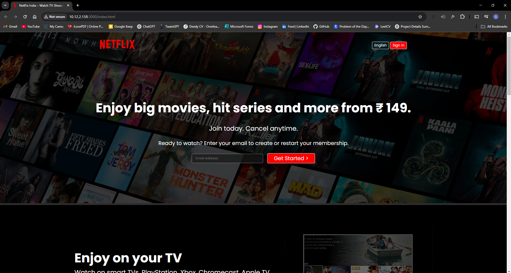

# 🎬 Netflix Clone

A simple **Netflix Clone** built using **HTML & CSS**, replicating the homepage design of Netflix.

## 🚀 Project Overview
This project is a front-end replica of Netflix's landing page. It features a clean UI, responsive design, and essential sections like the hero banner, subscription options, FAQs, and a footer.

## 🌟 Features
✅ **Responsive Design** - Works on different screen sizes  
✅ **Hero Section** - Includes a call-to-action for subscriptions  
✅ **CSS Styling** - Custom styles for a Netflix-like feel  
✅ **FAQ Section** - Expandable questions for user convenience  
✅ **Footer Section** - Contains useful links  

## 📸 Preview

## 🛠️ Technologies Used
- **HTML5** - Structuring the webpage  
- **CSS3** - Styling and layout  

## 📂 Folder Structure
/netflix-clone │── /assets │ ├── /images (Contains images and logo) │── index.html │── style.css │── README.md

## 💻 How to Run the Project
1. Clone the repository:  
2. Navigate into the project folder:  
3. Open `index.html` in your web browser.  

## 🤝 Contributing
Feel free to fork this project and submit a pull request if you want to contribute or improve it!

## 📩 Connect with Me
[GitHub](https://github.com/Itssanthoshhere) | [LinkedIn](https://linkedin.com/in/thesanthoshvs)

---
